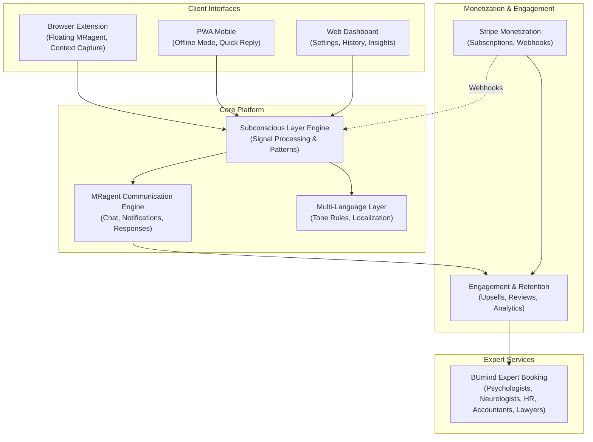
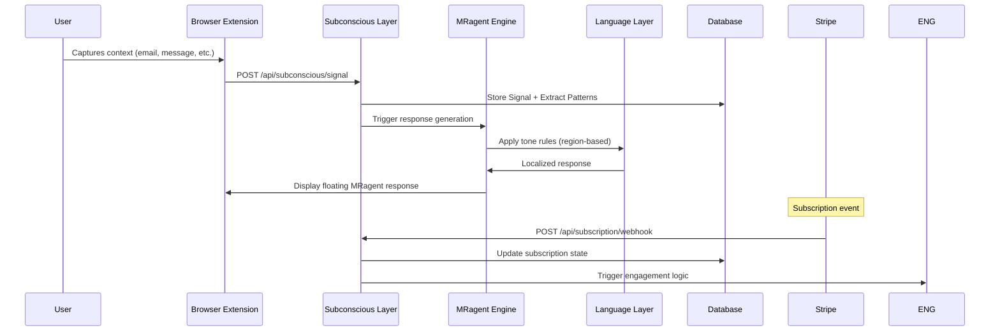

# Design Document: MindReply Platform Expansion

## Overview

MindReply Platform Expansion represents a complete reorganization of the operational composure system into eight integrated modules: Subconscious Layer Engine (primary), MRagent Communication Engine, Stripe Monetization, Multi-Language Layer, Engagement & Retention, Browser Extension, PWA Mobile, and BUmind Expert Booking Platform. This design establishes clear module boundaries, data flow patterns, and integration points while maintaining premium, minimal aesthetics and precise terminology (MRagent, MRteam, Subconscious Layer, signals, patterns—never "AI," "bot," or "automated").

The Subconscious Layer is the PRIMARY module, not a feature. All other modules depend on its signal processing and pattern recognition capabilities. Stripe webhooks serve as the source of truth for subscription state. BUmind operates as a separate domain with independent expert booking, appointment scheduling (1-hour slots), and payment-on-hold mechanics.

## Architecture Overview



## System Data Flow



## High-Level Module Architecture

### 1. Subconscious Layer Engine (PRIMARY)

**Purpose**: Core signal processing, pattern recognition, and operational composure analysis.

**Responsibilities**:
- Ingest signals from all client interfaces (browser extension, PWA, web)
- Extract patterns from user behavior, communication style, and operational context
- Generate snapshots of user state (stress level, composure, decision-making patterns)
- Maintain signal history and pattern database
- Serve as the foundation for all MRagent responses

**Key Entities**:
- Signal: Raw input (email, message, context, timestamp, source)
- Pattern: Extracted behavioral/communication pattern
- Snapshot: Point-in-time user state (composure score, stress indicators, decision patterns)
- Session: User interaction session with metadata

**Integration Points**:
- Receives signals from: Browser Extension, PWA, Web Dashboard
- Sends patterns to: MRagent Engine, Engagement & Retention
- Receives webhooks from: Stripe (subscription events)

### 2. MRagent Communication Engine

**Purpose**: Generate contextual, tone-aware responses and manage user communication.

**Responsibilities**:
- Consume signals and patterns from Subconscious Layer
- Generate MRagent responses (suggestions, guidance, operational composure tips)
- Manage notification delivery (bell icon, in-app, email)
- Handle message history and conversation context
- Integrate with Multi-Language Layer for tone adaptation

**Key Entities**:
- Message: Chat message (user or MRagent)
- Response: Generated MRagent response with confidence score
- Notification: Delivery record (type, channel, timestamp, read status)

**Integration Points**:
- Consumes from: Subconscious Layer Engine
- Sends to: Multi-Language Layer, Engagement & Retention, Client Interfaces
- Calls: LLM API (Anthropic Claude) for response generation

### 3. Multi-Language Layer

**Purpose**: Localize tone, language, and communication style based on user region and preferences.

**Responsibilities**:
- Detect user region (EU, US, RU, etc.)
- Apply region-specific tone rules (EU=formal, US=friendly, RU=direct)
- Translate responses to user language
- Maintain tone consistency across all communication channels
- Store language preferences and tone overrides

**Tone Rules**:
- **EU**: Formal, structured, compliance-aware, respectful of privacy
- **US**: Friendly, conversational, action-oriented, results-focused
- **RU**: Direct, pragmatic, efficiency-focused, no-nonsense
- **Default**: Balanced, professional, adaptable

**Integration Points**:
- Receives from: MRagent Engine
- Sends to: MRagent Engine (tone-adapted responses)
- Consumes: User region/language preferences from Database

### 4. Stripe Monetization

**Purpose**: Manage subscriptions, billing, and payment processing.

**Responsibilities**:
- Create and manage subscription products (Signal free, Growth, Pro)
- Handle checkout flow and payment processing
- Emit webhook events for subscription state changes
- Maintain subscription state in database
- Manage billing history and invoices

**Subscription Tiers**:
- **Signal (Free)**: Basic signal capture, limited patterns, community features
- **Growth**: Enhanced pattern analysis, MRagent responses, priority support
- **Pro**: Full Subconscious Layer access, expert booking integration, advanced analytics

**Webhook Events** (Source of Truth):
- `customer.subscription.created`
- `customer.subscription.updated`
- `customer.subscription.deleted`
- `invoice.payment_succeeded`
- `invoice.payment_failed`

**Integration Points**:
- Sends webhooks to: Subconscious Layer Engine
- Receives checkout redirects from: Web Dashboard, Engagement & Retention
- Stores subscription state in: Database

### 5. Engagement & Retention

**Purpose**: Drive user engagement, retention, and monetization through targeted upsells and feedback.

**Responsibilities**:
- Display upsell popups (upgrade prompts, feature highlights)
- Manage review collection and display
- Track engagement metrics (session duration, feature usage, conversion)
- Trigger retention campaigns based on user behavior
- Manage referral and loyalty programs

**Key Entities**:
- Review: User feedback on MRagent responses or platform
- UpsellEvent: Triggered upsell opportunity with conversion tracking
- EngagementMetric: User activity tracking (sessions, features used, time spent)

**Integration Points**:
- Receives from: Subconscious Layer, MRagent Engine
- Sends to: Stripe (checkout redirects), BUmind (expert booking upsells)
- Consumes: User subscription state from Database

### 6. Browser Extension

**Purpose**: Provide floating MRagent interface and context capture in user's browser.

**Responsibilities**:
- Display floating MRagent widget (always accessible)
- Capture email/message context (selected text, sender, subject, etc.)
- Send signals to Subconscious Layer
- Display MRagent responses inline
- Manage extension settings and permissions
- Handle offline queuing of signals

**Architecture**:
- `manifest.json`: Extension metadata, permissions, icons
- `popup.html/js`: Extension popup (settings, quick access)
- `background.js`: Service worker (event handling, API calls)
- `content.js`: Content script (DOM manipulation, context capture)
- `floating-widget.js`: Floating MRagent UI component

**Integration Points**:
- Sends signals to: Subconscious Layer Engine
- Receives responses from: MRagent Engine
- Stores locally: Signal queue, user preferences, auth token

### 7. PWA Mobile

**Purpose**: Provide mobile-first access with offline capabilities.

**Responsibilities**:
- Render responsive mobile interface
- Implement service worker for offline mode
- Cache critical data (recent signals, patterns, responses)
- Enable quick reply functionality
- Manage push notifications
- Sync queued signals when online

**Architecture**:
- `manifest.json`: PWA metadata, icons, theme colors
- `service-worker.js`: Offline caching, background sync
- `pages/`: Mobile-optimized pages (chat, signals, settings)
- `components/`: Mobile-specific components (quick reply, notification bell)

**Integration Points**:
- Sends signals to: Subconscious Layer Engine
- Receives from: MRagent Engine, Engagement & Retention
- Stores locally: Service worker cache, IndexedDB for signals

### 8. BUmind Expert Booking Platform

**Purpose**: Connect users with specialized experts for deeper consultation.

**Responsibilities**:
- Manage expert profiles (psychologists, neurologists, HR advisors, accountants, lawyers)
- Handle appointment scheduling (1-hour slots)
- Manage expert pricing and availability
- Process payment-on-hold mechanics (charge only after appointment completion)
- Track appointment history and reviews
- Integrate with calendar systems

**Key Entities**:
- Expert: Professional profile with specialization, bio, rates, availability
- Booking: Appointment reservation with user, expert, time, status
- Payment: Payment record with hold status (pending appointment completion)
- ExpertReview: User feedback on expert consultation

**Appointment Flow**:
1. User selects expert and time slot
2. System creates booking (status: pending)
3. Payment placed on hold (not charged)
4. Appointment occurs
5. Post-appointment: User confirms completion
6. Payment charged and released to expert
7. Review collection triggered

**Integration Points**:
- Receives upsell triggers from: Engagement & Retention
- Receives user context from: Subconscious Layer
- Processes payments via: Stripe
- Stores data in: Separate BUmind database (independent domain)

---

## Low-Level Design

### Folder Structure

```
src/
├── app/
│   ├── layout.tsx                    # Root layout with fonts, metadata
│   ├── page.tsx                      # Homepage
│   ├── dashboard/
│   │   ├── layout.tsx                # Dashboard layout
│   │   ├── page.tsx                  # Dashboard home
│   │   ├── signals/
│   │   │   ├── page.tsx              # Signal history
│   │   │   └── [id]/page.tsx         # Signal detail
│   │   ├── patterns/
│   │   │   ├── page.tsx              # Pattern analysis
│   │   │   └── [id]/page.tsx         # Pattern detail
│   │   ├── snapshots/
│   │   │   └── page.tsx              # Composure snapshots
│   │   ├── settings/
│   │   │   ├── page.tsx              # User settings
│   │   │   ├── language.tsx          # Language/tone preferences
│   │   │   └── notifications.tsx     # Notification preferences
│   │   └── expert-bookings/
│   │       ├── page.tsx              # Booking history
│   │       └── [id]/page.tsx         # Booking detail
│   ├── api/
│   │   ├── subconscious/
│   │   │   ├── signal/route.ts       # POST signal ingestion
│   │   │   ├── patterns/route.ts     # GET user patterns
│   │   │   ├── snapshots/route.ts    # GET composure snapshots
│   │   │   └── history/route.ts      # GET signal history
│   │   ├── mragent/
│   │   │   ├── chat/route.ts         # POST chat message
│   │   │   ├── response/route.ts     # GET MRagent response
│   │   │   └── notifications/route.ts # GET notifications
│   │   ├── language/
│   │   │   ├── detect/route.ts       # POST detect region/language
│   │   │   └── tone/route.ts         # GET tone rules for region
│   │   ├── subscription/
│   │   │   ├── webhook/route.ts      # POST Stripe webhook
│   │   │   ├── status/route.ts       # GET subscription status
│   │   │   └── checkout/route.ts     # POST create checkout session
│   │   ├── engagement/
│   │   │   ├── upsell/route.ts       # GET upsell opportunities
│   │   │   ├── review/route.ts       # POST submit review
│   │   │   └── metrics/route.ts      # POST engagement event
│   │   ├── expert/
│   │   │   ├── list/route.ts         # GET expert list
│   │   │   ├── availability/route.ts # GET expert availability
│   │   │   └── [id]/route.ts         # GET expert detail
│   │   └── booking/
│   │       ├── create/route.ts       # POST create booking
│   │       ├── confirm/route.ts      # POST confirm appointment
│   │       ├── cancel/route.ts       # POST cancel booking
│   │       └── [id]/route.ts         # GET booking detail
│   └── auth/
│       ├── login/page.tsx            # Login page
│       ├── signup/page.tsx           # Signup page
│       └── callback/route.ts         # OAuth callback
├── components/
│   ├── layout/
│   │   ├── Header.tsx                # Navigation header
│   │   ├── Footer.tsx                # Footer
│   │   └── Sidebar.tsx               # Dashboard sidebar
│   ├── dashboard/
│   │   ├── SignalCard.tsx            # Signal display card
│   │   ├── PatternChart.tsx          # Pattern visualization
│   │   ├── SnapshotWidget.tsx        # Composure snapshot display
│   │   ├── NotificationBell.tsx      # Notification bell icon
│   │   └── UpsellPopup.tsx           # Upsell modal
│   ├── mragent/
│   │   ├── ChatInterface.tsx         # Chat UI
│   │   ├── MessageBubble.tsx         # Message display
│   │   ├── ResponseLoader.tsx        # Loading state
│   │   └── FloatingWidget.tsx        # Floating MRagent (for extension)
│   ├── expert/
│   │   ├── ExpertCard.tsx            # Expert profile card
│   │   ├── BookingForm.tsx           # Booking form
│   │   ├── AvailabilityCalendar.tsx  # Appointment calendar
│   │   └── ReviewCard.tsx            # Review display
│   └── common/
│       ├── Button.tsx                # Reusable button
│       ├── Modal.tsx                 # Modal component
│       ├── Toast.tsx                 # Toast notification
│       └── Loading.tsx               # Loading spinner
├── lib/
│   ├── api/
│   │   ├── client.ts                 # API client wrapper
│   │   ├── subconscious.ts           # Subconscious Layer API
│   │   ├── mragent.ts                # MRagent API
│   │   ├── stripe.ts                 # Stripe API wrapper
│   │   ├── expert.ts                 # Expert booking API
│   │   └── language.ts               # Language detection API
│   ├── auth/
│   │   ├── session.ts                # Session management
│   │   ├── jwt.ts                    # JWT utilities
│   │   └── permissions.ts            # Permission checks
│   ├── db/
│   │   ├── connection.ts             # Database connection
│   │   ├── migrations/               # Database migrations
│   │   └── queries/
│   │       ├── users.ts              # User queries
│   │       ├── signals.ts            # Signal queries
│   │       ├── patterns.ts           # Pattern queries
│   │       ├── subscriptions.ts      # Subscription queries
│   │       ├── bookings.ts           # Booking queries
│   │       └── reviews.ts            # Review queries
│   ├── utils/
│   │   ├── signal-processor.ts       # Signal processing logic
│   │   ├── pattern-extractor.ts      # Pattern extraction
│   │   ├── tone-adapter.ts           # Tone rule application
│   │   ├── composure-calculator.ts   # Composure score calculation
│   │   └── validators.ts             # Input validation
│   └── constants/
│       ├── regions.ts                # Region/tone mappings
│       ├── subscription-tiers.ts     # Tier definitions
│       └── expert-specializations.ts # Expert categories
├── types/
│   ├── index.ts                      # Exported types
│   ├── user.ts                       # User types
│   ├── signal.ts                     # Signal types
│   ├── pattern.ts                    # Pattern types
│   ├── subscription.ts               # Subscription types
│   ├── booking.ts                    # Booking types
│   ├── expert.ts                     # Expert types
│   └── api.ts                        # API response types
├── styles/
│   ├── tailwind.css                  # Tailwind config + custom utilities
│   ├── variables.css                 # CSS custom properties
│   └── animations.css                # Animation definitions
└── middleware.ts                     # Next.js middleware (auth, logging)

public/
├── assets/
│   ├── images/
│   │   ├── logo.png
│   │   ├── hero-atmosphere.png
│   │   └── expert-avatars/
│   ├── icons/
│   │   ├── mragent-icon.svg
│   │   ├── signal-icon.svg
│   │   └── pattern-icon.svg
│   └── fonts/
│       ├── fraunces/
│       └── dm-sans/
├── manifest.json                     # PWA manifest
└── service-worker.js                 # Service worker for offline

extension/
├── manifest.json                     # Extension manifest v3
├── popup.html                        # Popup UI
├── popup.js                          # Popup logic
├── background.js                     # Service worker
├── content.js                        # Content script
├── floating-widget.js                # Floating MRagent widget
├── styles.css                        # Extension styles
└── icons/
    ├── icon-16.png
    ├── icon-48.png
    └── icon-128.png

bumind/
├── app/
│   ├── layout.tsx                    # BUmind layout
│   ├── page.tsx                      # Expert directory
│   ├── expert/
│   │   ├── [id]/page.tsx             # Expert profile
│   │   └── [id]/booking/page.tsx     # Booking page
│   ├── api/
│   │   ├── expert/
│   │   │   ├── list/route.ts
│   │   │   ├── [id]/route.ts
│   │   │   └── availability/route.ts
│   │   ├── booking/
│   │   │   ├── create/route.ts
│   │   │   ├── confirm/route.ts
│   │   │   └── [id]/route.ts
│   │   └── payment/
│   │       ├── hold/route.ts
│   │       └── release/route.ts
│   └── dashboard/
│       ├── page.tsx                  # Expert dashboard
│       ├── appointments/page.tsx     # Appointment management
│       └── earnings/page.tsx         # Earnings tracking
├── components/
│   ├── ExpertProfile.tsx
│   ├── BookingCalendar.tsx
│   └── PaymentStatus.tsx
├── lib/
│   ├── db/
│   │   └── bumind-connection.ts      # Separate BUmind DB
│   └── payment/
│       └── hold-manager.ts           # Payment hold logic
└── types/
    ├── expert.ts
    ├── booking.ts
    └── payment.ts

database/
├── schema/
│   ├── users.sql
│   ├── signals.sql
│   ├── patterns.sql
│   ├── snapshots.sql
│   ├── messages.sql
│   ├── subscriptions.sql
│   ├── reviews.sql
│   ├── notifications.sql
│   └── bumind-schema.sql             # Separate BUmind schema
├── migrations/
│   ├── 001_initial_schema.sql
│   ├── 002_add_patterns.sql
│   └── ...
└── seeds/
    ├── regions.sql
    ├── tone-rules.sql
    └── expert-specializations.sql
```


### API Endpoint Specifications

#### Subconscious Layer Endpoints

**POST /api/subconscious/signal**
- **Purpose**: Ingest a signal from any client interface
- **Request Body**:
  ```json
  {
    "type": "email|message|context|manual",
    "content": "string",
    "metadata": {
      "source": "browser-extension|pwa|web-dashboard",
      "sender": "string (optional)",
      "subject": "string (optional)",
      "timestamp": "ISO8601",
      "context": "object (optional)"
    }
  }
  ```
- **Response**:
  ```json
  {
    "signalId": "uuid",
    "status": "ingested",
    "patterns": ["pattern1", "pattern2"],
    "composureScore": 0.75
  }
  ```
- **Auth**: Required (Bearer token)

**GET /api/subconscious/patterns**
- **Purpose**: Retrieve extracted patterns for current user
- **Query Params**: `limit=20&offset=0&timeRange=7d`
- **Response**:
  ```json
  {
    "patterns": [
      {
        "id": "uuid",
        "name": "decision-avoidance",
        "frequency": 12,
        "lastOccurred": "ISO8601",
        "confidence": 0.89
      }
    ],
    "total": 45
  }
  ```
- **Auth**: Required

**GET /api/subconscious/snapshots**
- **Purpose**: Retrieve composure snapshots (point-in-time user state)
- **Query Params**: `limit=10&offset=0`
- **Response**:
  ```json
  {
    "snapshots": [
      {
        "id": "uuid",
        "timestamp": "ISO8601",
        "composureScore": 0.75,
        "stressIndicators": ["high-email-volume", "rapid-context-switching"],
        "decisionPatterns": ["risk-averse", "detail-focused"],
        "recommendations": ["take-break", "prioritize-top-3"]
      }
    ]
  }
  ```
- **Auth**: Required

**GET /api/subconscious/history**
- **Purpose**: Retrieve signal history with pagination
- **Query Params**: `limit=50&offset=0&type=email|message|context|all`
- **Response**:
  ```json
  {
    "signals": [
      {
        "id": "uuid",
        "type": "email",
        "content": "string",
        "timestamp": "ISO8601",
        "patterns": ["pattern1"],
        "composureScore": 0.72
      }
    ],
    "total": 234
  }
  ```
- **Auth**: Required

#### MRagent Communication Endpoints

**POST /api/mragent/chat**
- **Purpose**: Send a message and receive MRagent response
- **Request Body**:
  ```json
  {
    "message": "string",
    "context": {
      "signalId": "uuid (optional)",
      "conversationId": "uuid (optional)"
    }
  }
  ```
- **Response**:
  ```json
  {
    "messageId": "uuid",
    "response": "string",
    "confidence": 0.92,
    "suggestedActions": ["action1", "action2"],
    "tone": "friendly|formal|direct"
  }
  ```
- **Auth**: Required

**GET /api/mragent/response**
- **Purpose**: Get MRagent response for a signal without chat
- **Query Params**: `signalId=uuid`
- **Response**: Same as POST /api/mragent/chat
- **Auth**: Required

**GET /api/mragent/notifications**
- **Purpose**: Retrieve user notifications
- **Query Params**: `limit=20&offset=0&unreadOnly=false`
- **Response**:
  ```json
  {
    "notifications": [
      {
        "id": "uuid",
        "type": "pattern-detected|upsell|expert-available|booking-reminder",
        "title": "string",
        "message": "string",
        "timestamp": "ISO8601",
        "read": false,
        "actionUrl": "string (optional)"
      }
    ],
    "unreadCount": 3
  }
  ```
- **Auth**: Required

#### Language Layer Endpoints

**POST /api/language/detect**
- **Purpose**: Detect user region and language preferences
- **Request Body**:
  ```json
  {
    "ipAddress": "string (optional)",
    "userAgent": "string (optional)",
    "manualRegion": "EU|US|RU|other (optional)"
  }
  ```
- **Response**:
  ```json
  {
    "region": "EU",
    "language": "en",
    "toneStyle": "formal",
    "confidence": 0.95
  }
  ```
- **Auth**: Optional

**GET /api/language/tone**
- **Purpose**: Get tone rules for a specific region
- **Query Params**: `region=EU|US|RU`
- **Response**:
  ```json
  {
    "region": "EU",
    "toneRules": {
      "formality": "high",
      "directness": "medium",
      "emotionalTone": "neutral",
      "privacyFocus": true,
      "complianceAware": true
    },
    "examples": ["example1", "example2"]
  }
  ```
- **Auth**: Optional

#### Subscription Endpoints

**POST /api/subscription/webhook**
- **Purpose**: Receive Stripe webhook events (source of truth)
- **Request Body**: Stripe webhook payload
- **Response**: `{ "received": true }`
- **Auth**: Stripe signature verification
- **Events Handled**:
  - `customer.subscription.created`
  - `customer.subscription.updated`
  - `customer.subscription.deleted`
  - `invoice.payment_succeeded`
  - `invoice.payment_failed`

**GET /api/subscription/status**
- **Purpose**: Get current subscription status
- **Response**:
  ```json
  {
    "tier": "Signal|Growth|Pro",
    "status": "active|canceled|past_due",
    "currentPeriodStart": "ISO8601",
    "currentPeriodEnd": "ISO8601",
    "cancelAtPeriodEnd": false,
    "features": ["feature1", "feature2"]
  }
  ```
- **Auth**: Required

**POST /api/subscription/checkout**
- **Purpose**: Create Stripe checkout session
- **Request Body**:
  ```json
  {
    "tier": "Growth|Pro",
    "billingCycle": "monthly|annual"
  }
  ```
- **Response**:
  ```json
  {
    "sessionId": "string",
    "checkoutUrl": "string"
  }
  ```
- **Auth**: Required

#### Engagement Endpoints

**GET /api/engagement/upsell**
- **Purpose**: Get upsell opportunities for current user
- **Response**:
  ```json
  {
    "opportunities": [
      {
        "id": "uuid",
        "type": "upgrade|feature|expert-booking",
        "title": "string",
        "description": "string",
        "cta": "string",
        "targetTier": "Growth|Pro (optional)"
      }
    ]
  }
  ```
- **Auth**: Required

**POST /api/engagement/review**
- **Purpose**: Submit a review
- **Request Body**:
  ```json
  {
    "targetType": "mragent-response|expert-consultation|platform",
    "targetId": "uuid (optional)",
    "rating": 1-5,
    "comment": "string (optional)"
  }
  ```
- **Response**:
  ```json
  {
    "reviewId": "uuid",
    "status": "submitted"
  }
  ```
- **Auth**: Required

**POST /api/engagement/metrics**
- **Purpose**: Track engagement events
- **Request Body**:
  ```json
  {
    "event": "session-start|feature-used|signal-submitted|response-viewed",
    "metadata": "object (optional)"
  }
  ```
- **Response**: `{ "recorded": true }`
- **Auth**: Required

#### Expert Booking Endpoints

**GET /api/expert/list**
- **Purpose**: Get list of available experts
- **Query Params**: `specialization=psychologist|neurologist|hr|accountant|lawyer&limit=20&offset=0`
- **Response**:
  ```json
  {
    "experts": [
      {
        "id": "uuid",
        "name": "string",
        "specialization": "string",
        "bio": "string",
        "rating": 4.8,
        "reviewCount": 42,
        "hourlyRate": 150,
        "availability": "available|booked|on-break"
      }
    ],
    "total": 87
  }
  ```
- **Auth**: Required (Growth/Pro tier)

**GET /api/expert/[id]**
- **Purpose**: Get expert profile details
- **Response**:
  ```json
  {
    "id": "uuid",
    "name": "string",
    "specialization": "string",
    "bio": "string",
    "credentials": ["credential1", "credential2"],
    "rating": 4.8,
    "reviews": [{ "author": "string", "rating": 5, "comment": "string" }],
    "hourlyRate": 150,
    "availability": { "monday": ["09:00-17:00"], "tuesday": ["09:00-17:00"] }
  }
  ```
- **Auth**: Required

**GET /api/expert/availability**
- **Purpose**: Get expert availability for booking
- **Query Params**: `expertId=uuid&month=2024-01`
- **Response**:
  ```json
  {
    "expertId": "uuid",
    "availableSlots": [
      {
        "date": "2024-01-15",
        "time": "14:00",
        "duration": 60
      }
    ]
  }
  ```
- **Auth**: Required

**POST /api/booking/create**
- **Purpose**: Create a new booking
- **Request Body**:
  ```json
  {
    "expertId": "uuid",
    "date": "2024-01-15",
    "time": "14:00",
    "reason": "string (optional)"
  }
  ```
- **Response**:
  ```json
  {
    "bookingId": "uuid",
    "status": "pending",
    "expert": { "id": "uuid", "name": "string" },
    "appointmentTime": "ISO8601",
    "paymentStatus": "on-hold",
    "amount": 150
  }
  ```
- **Auth**: Required

**POST /api/booking/confirm**
- **Purpose**: Confirm appointment completion (triggers payment release)
- **Request Body**:
  ```json
  {
    "bookingId": "uuid",
    "notes": "string (optional)"
  }
  ```
- **Response**:
  ```json
  {
    "bookingId": "uuid",
    "status": "completed",
    "paymentStatus": "released",
    "reviewPrompt": true
  }
  ```
- **Auth**: Required

**POST /api/booking/cancel**
- **Purpose**: Cancel a booking
- **Request Body**:
  ```json
  {
    "bookingId": "uuid",
    "reason": "string (optional)"
  }
  ```
- **Response**:
  ```json
  {
    "bookingId": "uuid",
    "status": "canceled",
    "paymentStatus": "released"
  }
  ```
- **Auth**: Required

**GET /api/booking/[id]**
- **Purpose**: Get booking details
- **Response**:
  ```json
  {
    "id": "uuid",
    "expert": { "id": "uuid", "name": "string", "specialization": "string" },
    "appointmentTime": "ISO8601",
    "status": "pending|completed|canceled",
    "paymentStatus": "on-hold|released|failed",
    "amount": 150,
    "notes": "string (optional)"
  }
  ```
- **Auth**: Required


### Database Schema (PostgreSQL)

#### Users Table
```sql
CREATE TABLE users (
  id UUID PRIMARY KEY DEFAULT gen_random_uuid(),
  email VARCHAR(255) UNIQUE NOT NULL,
  password_hash VARCHAR(255) NOT NULL,
  name VARCHAR(255),
  region VARCHAR(50),
  language VARCHAR(10) DEFAULT 'en',
  tone_preference VARCHAR(50),
  subscription_tier VARCHAR(50) DEFAULT 'Signal',
  stripe_customer_id VARCHAR(255),
  created_at TIMESTAMP DEFAULT CURRENT_TIMESTAMP,
  updated_at TIMESTAMP DEFAULT CURRENT_TIMESTAMP,
  deleted_at TIMESTAMP
);
```

#### Signals Table
```sql
CREATE TABLE signals (
  id UUID PRIMARY KEY DEFAULT gen_random_uuid(),
  user_id UUID NOT NULL REFERENCES users(id),
  type VARCHAR(50) NOT NULL,
  content TEXT NOT NULL,
  source VARCHAR(50) NOT NULL,
  metadata JSONB,
  composure_score DECIMAL(3,2),
  created_at TIMESTAMP DEFAULT CURRENT_TIMESTAMP,
  INDEX idx_user_created (user_id, created_at)
);
```

#### Patterns Table
```sql
CREATE TABLE patterns (
  id UUID PRIMARY KEY DEFAULT gen_random_uuid(),
  user_id UUID NOT NULL REFERENCES users(id),
  name VARCHAR(255) NOT NULL,
  description TEXT,
  frequency INTEGER DEFAULT 1,
  confidence DECIMAL(3,2),
  pattern_data JSONB,
  last_occurred_at TIMESTAMP,
  created_at TIMESTAMP DEFAULT CURRENT_TIMESTAMP,
  updated_at TIMESTAMP DEFAULT CURRENT_TIMESTAMP,
  INDEX idx_user_patterns (user_id, confidence DESC)
);
```

#### Snapshots Table
```sql
CREATE TABLE snapshots (
  id UUID PRIMARY KEY DEFAULT gen_random_uuid(),
  user_id UUID NOT NULL REFERENCES users(id),
  composure_score DECIMAL(3,2),
  stress_indicators JSONB,
  decision_patterns JSONB,
  recommendations JSONB,
  created_at TIMESTAMP DEFAULT CURRENT_TIMESTAMP,
  INDEX idx_user_snapshots (user_id, created_at DESC)
);
```

#### Messages Table
```sql
CREATE TABLE messages (
  id UUID PRIMARY KEY DEFAULT gen_random_uuid(),
  user_id UUID NOT NULL REFERENCES users(id),
  conversation_id UUID,
  sender VARCHAR(50) NOT NULL,
  content TEXT NOT NULL,
  tone VARCHAR(50),
  confidence DECIMAL(3,2),
  created_at TIMESTAMP DEFAULT CURRENT_TIMESTAMP,
  INDEX idx_conversation (conversation_id, created_at)
);
```

#### Subscriptions Table
```sql
CREATE TABLE subscriptions (
  id UUID PRIMARY KEY DEFAULT gen_random_uuid(),
  user_id UUID NOT NULL REFERENCES users(id),
  stripe_subscription_id VARCHAR(255) UNIQUE,
  tier VARCHAR(50) NOT NULL,
  status VARCHAR(50) NOT NULL,
  current_period_start TIMESTAMP,
  current_period_end TIMESTAMP,
  cancel_at_period_end BOOLEAN DEFAULT FALSE,
  created_at TIMESTAMP DEFAULT CURRENT_TIMESTAMP,
  updated_at TIMESTAMP DEFAULT CURRENT_TIMESTAMP,
  INDEX idx_user_subscription (user_id)
);
```

#### Reviews Table
```sql
CREATE TABLE reviews (
  id UUID PRIMARY KEY DEFAULT gen_random_uuid(),
  user_id UUID NOT NULL REFERENCES users(id),
  target_type VARCHAR(50) NOT NULL,
  target_id UUID,
  rating INTEGER CHECK (rating >= 1 AND rating <= 5),
  comment TEXT,
  created_at TIMESTAMP DEFAULT CURRENT_TIMESTAMP,
  INDEX idx_target (target_type, target_id)
);
```

#### Notifications Table
```sql
CREATE TABLE notifications (
  id UUID PRIMARY KEY DEFAULT gen_random_uuid(),
  user_id UUID NOT NULL REFERENCES users(id),
  type VARCHAR(50) NOT NULL,
  title VARCHAR(255),
  message TEXT,
  action_url VARCHAR(255),
  read BOOLEAN DEFAULT FALSE,
  created_at TIMESTAMP DEFAULT CURRENT_TIMESTAMP,
  INDEX idx_user_notifications (user_id, read, created_at DESC)
);
```

#### BUmind Experts Table (Separate Database)
```sql
CREATE TABLE experts (
  id UUID PRIMARY KEY DEFAULT gen_random_uuid(),
  name VARCHAR(255) NOT NULL,
  specialization VARCHAR(100) NOT NULL,
  bio TEXT,
  credentials JSONB,
  hourly_rate DECIMAL(10,2),
  rating DECIMAL(3,2),
  review_count INTEGER DEFAULT 0,
  availability JSONB,
  stripe_account_id VARCHAR(255),
  created_at TIMESTAMP DEFAULT CURRENT_TIMESTAMP,
  updated_at TIMESTAMP DEFAULT CURRENT_TIMESTAMP,
  INDEX idx_specialization (specialization)
);
```

#### BUmind Bookings Table (Separate Database)
```sql
CREATE TABLE bookings (
  id UUID PRIMARY KEY DEFAULT gen_random_uuid(),
  user_id UUID NOT NULL,
  expert_id UUID NOT NULL REFERENCES experts(id),
  appointment_time TIMESTAMP NOT NULL,
  duration_minutes INTEGER DEFAULT 60,
  status VARCHAR(50) NOT NULL,
  reason TEXT,
  notes TEXT,
  created_at TIMESTAMP DEFAULT CURRENT_TIMESTAMP,
  updated_at TIMESTAMP DEFAULT CURRENT_TIMESTAMP,
  INDEX idx_user_bookings (user_id, appointment_time),
  INDEX idx_expert_bookings (expert_id, appointment_time)
);
```

#### BUmind Payments Table (Separate Database)
```sql
CREATE TABLE payments (
  id UUID PRIMARY KEY DEFAULT gen_random_uuid(),
  booking_id UUID NOT NULL REFERENCES bookings(id),
  user_id UUID NOT NULL,
  expert_id UUID NOT NULL,
  amount DECIMAL(10,2),
  status VARCHAR(50) NOT NULL,
  stripe_payment_intent_id VARCHAR(255),
  held_at TIMESTAMP,
  released_at TIMESTAMP,
  created_at TIMESTAMP DEFAULT CURRENT_TIMESTAMP,
  INDEX idx_booking_payment (booking_id)
);
```

#### BUmind Expert Reviews Table (Separate Database)
```sql
CREATE TABLE expert_reviews (
  id UUID PRIMARY KEY DEFAULT gen_random_uuid(),
  booking_id UUID NOT NULL REFERENCES bookings(id),
  user_id UUID NOT NULL,
  expert_id UUID NOT NULL,
  rating INTEGER CHECK (rating >= 1 AND rating <= 5),
  comment TEXT,
  created_at TIMESTAMP DEFAULT CURRENT_TIMESTAMP,
  INDEX idx_expert_reviews (expert_id)
);
```


### Component Architecture

#### Floating MRagent Widget (Browser Extension & PWA)

**Purpose**: Always-accessible MRagent interface for quick access to responses and guidance.

**Structure**:
```
FloatingWidget
├── WidgetToggle (minimize/expand button)
├── WidgetHeader (title, close button)
├── WidgetContent
│   ├── ChatHistory (scrollable message list)
│   ├── InputArea
│   │   ├── TextInput
│   │   └── SendButton
│   └── QuickActions (preset responses)
└── WidgetFooter (powered by MRagent, settings link)
```

**Styling**:
- Position: Fixed bottom-right corner
- Size: 380px width × 500px height (expandable)
- Theme: Dark premium (--background, --card, --primary gold accents)
- Animation: Slide-in from bottom-right, smooth transitions
- Z-index: 9999 (above all page content)

**Interactions**:
- Click toggle to minimize/expand
- Drag to reposition
- Click outside to minimize (optional)
- Keyboard shortcut (Cmd+Shift+M) to toggle

#### Notification Bell Component

**Purpose**: Display unread notifications and provide quick access to notification center.

**Structure**:
```
NotificationBell
├── BellIcon (with unread count badge)
├── Dropdown (on click)
│   ├── NotificationList
│   │   └── NotificationItem (repeating)
│   │       ├── Icon (by type)
│   │       ├── Title & Message
│   │       ├── Timestamp
│   │       └── ActionButton (optional)
│   └── ViewAllLink
└── MarkAllAsReadButton
```

**Notification Types**:
- `pattern-detected`: "New pattern identified: decision-avoidance"
- `upsell`: "Upgrade to Growth tier for advanced analytics"
- `expert-available`: "Dr. Sarah Chen is now available for booking"
- `booking-reminder`: "Your appointment with Dr. Chen is in 1 hour"

**Styling**:
- Bell icon: 24px, gold accent on hover
- Badge: Red circle with white count
- Dropdown: 320px width, max 5 visible items, scroll if more
- Animation: Subtle pulse on new notification

#### Review Card Component

**Purpose**: Display and collect user reviews on MRagent responses or expert consultations.

**Structure**:
```
ReviewCard
├── Header
│   ├── TargetInfo (response snippet or expert name)
│   └── Timestamp
├── RatingInput
│   └── StarRating (1-5, interactive)
├── CommentInput
│   └── TextArea (optional)
└── Actions
    ├── SubmitButton
    └── CancelButton
```

**Styling**:
- Card: 400px width, rounded corners, subtle shadow
- Stars: Gold (#c9a96e) when selected, gray when unselected
- Textarea: 100px height, placeholder text
- Buttons: Primary (gold) and secondary (gray)

#### Upsell Popup Component

**Purpose**: Display upgrade opportunities and feature highlights.

**Structure**:
```
UpsellPopup
├── Overlay (semi-transparent dark background)
└── Modal
    ├── Header
    │   ├── Title
    │   └── CloseButton
    ├── Content
    │   ├── FeatureHighlight (icon + description)
    │   ├── BenefitsList
    │   └── PricingInfo
    └── Actions
        ├── UpgradeButton (primary)
        └── DismissButton (secondary)
```

**Upsell Triggers**:
- User reaches signal limit on free tier
- User views expert booking (requires Growth/Pro)
- User requests advanced pattern analysis
- User has been active for 7+ days on free tier

**Styling**:
- Modal: 500px width, centered on screen
- Overlay: rgba(0,0,0,0.7)
- Buttons: Primary (gold), secondary (transparent with border)
- Animation: Fade-in, scale-up entrance

#### Signal Card Component

**Purpose**: Display individual signals in history/dashboard.

**Structure**:
```
SignalCard
├── Header
│   ├── SignalType (email, message, context)
│   ├── Source (browser-extension, pwa, web)
│   └── Timestamp
├── Content
│   ├── SignalPreview (truncated text)
│   └── ExpandButton (if truncated)
├── Metadata
│   ├── ComposureScore (visual indicator)
│   ├── PatternsDetected (tag list)
│   └── MRagentResponse (snippet)
└── Actions
    ├── ViewDetailButton
    └── DeleteButton
```

**Styling**:
- Card: 100% width, max 600px, rounded corners
- Composure score: Color-coded (red <0.5, yellow 0.5-0.75, green >0.75)
- Tags: Small pills with background color
- Hover: Subtle shadow increase, cursor pointer

#### Pattern Chart Component

**Purpose**: Visualize extracted patterns and their frequency/confidence.

**Structure**:
```
PatternChart
├── ChartType (bar, line, radar - user selectable)
├── Legend (pattern names with colors)
├── Chart (interactive visualization)
└── Stats
    ├── TotalPatterns
    ├── MostFrequent
    └── HighestConfidence
```

**Visualization Types**:
- **Bar Chart**: Frequency vs. Confidence (x-axis: patterns, y-axis: frequency, color: confidence)
- **Line Chart**: Pattern frequency over time (x-axis: date, y-axis: frequency)
- **Radar Chart**: Multi-dimensional pattern analysis (axes: frequency, confidence, recency, impact)

**Styling**:
- Colors: Gold (#c9a96e) for primary, muted grays for secondary
- Interactive: Hover to show exact values, click to filter
- Responsive: Adapt to container width

#### Composure Snapshot Widget

**Purpose**: Display point-in-time user state with composure score and recommendations.

**Structure**:
```
SnapshotWidget
├── Header
│   ├── Title ("Your Composure Snapshot")
│   └── Timestamp
├── ComposureScore
│   ├── CircularProgress (0-100)
│   ├── ScoreLabel
│   └── Interpretation (calm, balanced, stressed)
├── StressIndicators
│   └── IndicatorTag (repeating)
├── DecisionPatterns
│   └── PatternTag (repeating)
├── Recommendations
│   └── RecommendationItem (repeating)
│       ├── Icon
│       ├── Text
│       └── ActionButton (optional)
└── RefreshButton
```

**Styling**:
- Widget: 400px width, card style
- Circular progress: Gold ring on dark background
- Score label: Large, bold typography
- Tags: Colored pills (stress=red, pattern=blue, recommendation=gold)
- Recommendations: Actionable items with icons

#### Expert Card Component

**Purpose**: Display expert profile in directory or booking flow.

**Structure**:
```
ExpertCard
├── Avatar (profile image)
├── Header
│   ├── Name
│   ├── Specialization
│   └── Rating (stars + count)
├── Bio (truncated)
├── Credentials (tag list)
├── Pricing
│   ├── HourlyRate
│   └── AvailabilityStatus
└── Actions
    ├── ViewProfileButton
    └── BookButton
```

**Styling**:
- Card: 280px width, rounded corners, hover shadow
- Avatar: 80px circular image
- Rating: Gold stars, gray count
- Buttons: Primary (gold) and secondary (transparent)
- Hover: Subtle scale increase, shadow enhancement

#### Booking Form Component

**Purpose**: Multi-step form for creating expert bookings.

**Structure**:
```
BookingForm
├── Step1: SelectExpert
│   ├── ExpertSearch
│   └── ExpertList
├── Step2: SelectDateTime
│   ├── AvailabilityCalendar
│   └── TimeSlotSelector
├── Step3: ConfirmDetails
│   ├── BookingSummary
│   ├── PricingBreakdown
│   └── TermsCheckbox
└── Actions
    ├── PreviousButton
    ├── NextButton
    └── ConfirmButton
```

**Styling**:
- Form: 600px width, card style
- Steps: Progress indicator at top
- Calendar: Month view with available dates highlighted
- Summary: Clear pricing breakdown with total
- Buttons: Previous (secondary), Next/Confirm (primary gold)

#### Availability Calendar Component

**Purpose**: Display expert availability and allow time slot selection.

**Structure**:
```
AvailabilityCalendar
├── MonthNavigation (prev/next buttons)
├── CalendarGrid
│   └── DateCell (repeating)
│       ├── Date number
│       ├── AvailabilityIndicator (available/booked/unavailable)
│       └── Click to expand time slots
├── TimeSlotSelector (if date selected)
│   └── TimeSlot (repeating, 1-hour increments)
│       ├── Time
│       ├── AvailabilityStatus
│       └── SelectButton
└── SelectedSlotDisplay
```

**Styling**:
- Calendar: 100% width, max 500px
- Available dates: Gold background
- Booked dates: Gray background
- Selected date: Gold border, highlighted
- Time slots: 60px height, clickable rows
- Selected slot: Gold background, checkmark


### Browser Extension Architecture

#### Manifest.json (Chrome Extension Manifest v3)

```json
{
  "manifest_version": 3,
  "name": "MRagent",
  "version": "1.0.0",
  "description": "Operational composure system for email and messaging",
  "permissions": [
    "activeTab",
    "scripting",
    "storage",
    "webRequest",
    "tabs"
  ],
  "host_permissions": [
    "https://mail.google.com/*",
    "https://outlook.office.com/*",
    "https://slack.com/*",
    "https://teams.microsoft.com/*"
  ],
  "background": {
    "service_worker": "background.js"
  },
  "action": {
    "default_popup": "popup.html",
    "default_icon": {
      "16": "icons/icon-16.png",
      "48": "icons/icon-48.png",
      "128": "icons/icon-128.png"
    }
  },
  "content_scripts": [
    {
      "matches": [
        "https://mail.google.com/*",
        "https://outlook.office.com/*",
        "https://slack.com/*",
        "https://teams.microsoft.com/*"
      ],
      "js": ["content.js"],
      "css": ["styles.css"]
    }
  ],
  "icons": {
    "16": "icons/icon-16.png",
    "48": "icons/icon-48.png",
    "128": "icons/icon-128.png"
  }
}
```

#### Extension Components

**popup.html/popup.js** - Extension Popup
- Quick access to MRagent chat
- Settings link
- Signal history preview
- Notification count
- Login/logout

**background.js** - Service Worker
- Listen for content script messages
- Handle API calls to backend
- Manage authentication token
- Queue signals when offline
- Sync queued signals when online
- Handle context menu interactions

**content.js** - Content Script
- Inject floating widget into page
- Capture selected text/email content
- Detect email/message context (sender, subject, etc.)
- Send signals to background script
- Display MRagent responses inline

**floating-widget.js** - Floating Widget
- Render floating MRagent UI
- Handle user interactions
- Display responses
- Manage minimize/expand state
- Store widget position in localStorage

**styles.css** - Extension Styles
- Floating widget styling
- Dark premium theme
- Gold accents
- Responsive design
- Animation definitions

#### Signal Capture Flow

```
User selects text in Gmail
    ↓
content.js detects selection
    ↓
Floating widget appears with "Analyze" button
    ↓
User clicks "Analyze"
    ↓
content.js extracts context:
  - Selected text
  - Email sender
  - Email subject
  - Email timestamp
  - Current URL
    ↓
background.js receives message
    ↓
If online: POST to /api/subconscious/signal
If offline: Queue in IndexedDB
    ↓
Response received
    ↓
floating-widget.js displays MRagent response
    ↓
User can:
  - Copy response
  - Send as reply
  - Save to notes
  - Rate response
```

#### Offline Queuing

- Store signals in IndexedDB with timestamp
- When online, sync queued signals in order
- Mark as synced after successful POST
- Retry failed signals with exponential backoff
- Show sync status in popup

### PWA Mobile Architecture

#### manifest.json (PWA Manifest)

```json
{
  "name": "MRagent",
  "short_name": "MRagent",
  "description": "Operational composure system",
  "start_url": "/",
  "scope": "/",
  "display": "standalone",
  "orientation": "portrait-primary",
  "theme_color": "#09090b",
  "background_color": "#09090b",
  "icons": [
    {
      "src": "/assets/icons/icon-192.png",
      "sizes": "192x192",
      "type": "image/png",
      "purpose": "any"
    },
    {
      "src": "/assets/icons/icon-512.png",
      "sizes": "512x512",
      "type": "image/png",
      "purpose": "any"
    },
    {
      "src": "/assets/icons/icon-maskable-192.png",
      "sizes": "192x192",
      "type": "image/png",
      "purpose": "maskable"
    }
  ],
  "screenshots": [
    {
      "src": "/assets/screenshots/screenshot-1.png",
      "sizes": "540x720",
      "type": "image/png",
      "form_factor": "narrow"
    }
  ],
  "shortcuts": [
    {
      "name": "New Signal",
      "short_name": "Signal",
      "description": "Capture a new signal",
      "url": "/dashboard/signals/new",
      "icons": [
        {
          "src": "/assets/icons/signal-icon.png",
          "sizes": "192x192"
        }
      ]
    },
    {
      "name": "Chat with MRagent",
      "short_name": "Chat",
      "description": "Open MRagent chat",
      "url": "/dashboard/chat",
      "icons": [
        {
          "src": "/assets/icons/chat-icon.png",
          "sizes": "192x192"
        }
      ]
    }
  ]
}
```

#### Service Worker (service-worker.js)

**Responsibilities**:
- Cache critical assets on install
- Serve cached assets when offline
- Background sync for queued signals
- Push notification handling
- Periodic background sync for pattern updates

**Cache Strategy**:
- **Cache First**: Static assets (CSS, JS, images)
- **Network First**: API calls (with fallback to cache)
- **Stale While Revalidate**: User data (patterns, snapshots)

**Offline Features**:
- View cached signal history
- View cached patterns and snapshots
- Queue new signals for sync
- Display "offline mode" indicator
- Auto-sync when online

#### Quick Reply Feature

**Purpose**: Allow users to quickly respond to emails/messages without leaving the app.

**Implementation**:
- Store recent MRagent responses in cache
- Display quick reply suggestions on signal detail page
- One-click copy to clipboard
- One-click send to email/message (if integrated)
- Custom quick reply templates

**UI**:
```
Signal Detail
├── Signal Content
├── MRagent Response
└── Quick Reply Section
    ├── SuggestedReplies (3-5 options)
    │   └── ReplyCard (repeating)
    │       ├── Reply text (truncated)
    │       ├── CopyButton
    │       └── SendButton
    └── CustomReplyInput
        ├── TextArea
        └── SendButton
```

#### Offline Mode Indicator

- Banner at top of app: "You're offline. Changes will sync when online."
- Sync status in settings: "Last synced: 2 minutes ago"
- Queued signals counter: "3 signals waiting to sync"
- Manual sync button: "Sync now"

### Stripe Integration Flow

#### Checkout Flow

```
User clicks "Upgrade to Growth"
    ↓
Frontend calls POST /api/subscription/checkout
    ↓
Backend creates Stripe checkout session
    ↓
Backend returns sessionId and checkoutUrl
    ↓
Frontend redirects to Stripe checkout
    ↓
User enters payment details
    ↓
Stripe processes payment
    ↓
Stripe redirects to success URL
    ↓
Frontend shows "Upgrade successful"
    ↓
User subscription tier updated in database
```

#### Webhook Flow (Source of Truth)

```
Stripe event occurs (subscription created/updated/deleted)
    ↓
Stripe sends webhook to POST /api/subscription/webhook
    ↓
Backend verifies Stripe signature
    ↓
Backend processes event:
  - customer.subscription.created: Create subscription record
  - customer.subscription.updated: Update subscription status
  - customer.subscription.deleted: Mark subscription as canceled
  - invoice.payment_succeeded: Update payment status
  - invoice.payment_failed: Mark subscription as past_due
    ↓
Backend updates user subscription tier
    ↓
Backend triggers engagement logic (upsells, feature access)
    ↓
Backend returns 200 OK to Stripe
```

#### Subscription Tiers

**Signal (Free)**:
- Price: $0
- Features:
  - Basic signal capture (10/month)
  - Limited pattern analysis
  - Community features
  - Email support

**Growth ($29/month or $290/year)**:
- Features:
  - Unlimited signal capture
  - Enhanced pattern analysis
  - MRagent responses
  - Priority support
  - Expert booking (read-only)

**Pro ($99/month or $990/year)**:
- Features:
  - Everything in Growth
  - Full expert booking with appointments
  - Advanced analytics
  - Custom tone rules
  - API access
  - Dedicated support

### Language Detection & Tone Rules

#### Region Detection

**Methods**:
1. User IP address geolocation (on signup)
2. Browser language preference (navigator.language)
3. Manual region selection in settings
4. Automatic re-detection on location change

**Supported Regions**:
- EU (Europe)
- US (United States)
- RU (Russia)
- Other (default to balanced)

#### Tone Rules by Region

**EU (Formal)**:
- Formality: High
- Directness: Medium
- Emotional tone: Neutral
- Privacy focus: Yes
- Compliance aware: Yes
- Example: "I would respectfully suggest considering the following approach..."

**US (Friendly)**:
- Formality: Low
- Directness: High
- Emotional tone: Warm
- Privacy focus: Medium
- Compliance aware: Medium
- Example: "Here's a great way to handle this..."

**RU (Direct)**:
- Formality: Low
- Directness: Very High
- Emotional tone: Neutral
- Privacy focus: Low
- Compliance aware: Low
- Example: "Do this. It works."

**Default (Balanced)**:
- Formality: Medium
- Directness: Medium
- Emotional tone: Professional
- Privacy focus: Medium
- Compliance aware: Medium
- Example: "Here's a practical approach to consider..."

#### Tone Application

**Process**:
1. Generate MRagent response (neutral)
2. Detect user region
3. Apply tone rules to response
4. Translate to user language
5. Return tone-adapted response

**Implementation**:
- Tone rules stored in database
- Applied via prompt engineering in LLM call
- Cached for performance
- User can override tone preference


## Data Flow Patterns

### Signal Ingestion Pipeline

```
Signal Input (Browser Extension, PWA, Web)
    ↓
Validate signal format and content
    ↓
Store signal in database
    ↓
Extract patterns from signal
    ↓
Update user composure score
    ↓
Generate snapshot if threshold met
    ↓
Trigger MRagent response generation
    ↓
Apply tone rules based on region
    ↓
Return response to client
    ↓
Store message in conversation history
    ↓
Trigger engagement logic (upsells, notifications)
```

### Pattern Extraction Algorithm

```
For each new signal:
  1. Tokenize content
  2. Extract entities (people, dates, actions, emotions)
  3. Compare against existing patterns
  4. Calculate similarity score
  5. If similarity > 0.7:
     - Increment pattern frequency
     - Update last_occurred_at
     - Recalculate confidence
  6. If similarity < 0.7:
     - Create new pattern
     - Set initial frequency = 1
     - Set initial confidence = 0.5
  7. Update user composure score based on patterns
  8. Generate snapshot if:
     - 10+ new signals since last snapshot, OR
     - Composure score changed by >0.15, OR
     - New high-confidence pattern detected
```

### Composure Score Calculation

```
Base score = 1.0

For each detected pattern:
  - If pattern is stress-related: score -= (frequency * confidence * 0.1)
  - If pattern is positive: score += (frequency * confidence * 0.05)

For each recent signal:
  - If signal contains stress indicators: score -= 0.05
  - If signal contains positive indicators: score += 0.03

Normalize score to 0-1 range
Apply exponential smoothing: score = (0.7 * previous_score) + (0.3 * new_score)

Result: Composure score between 0 (stressed) and 1 (calm)
```

### Subscription State Management

**Source of Truth**: Stripe webhooks

**State Transitions**:
```
Free (Signal tier)
    ↓ (user upgrades)
Pending (awaiting payment)
    ↓ (payment succeeds)
Active (Growth or Pro)
    ↓ (user cancels)
Canceled (at period end)
    ↓ (period ends)
Expired (no longer active)

OR

Active
    ↓ (payment fails)
Past Due
    ↓ (payment retried and succeeds)
Active
    ↓ (payment retried and fails)
Canceled
```

**Database Updates**:
- Only update subscription state on webhook receipt
- Never update subscription state from client
- Verify webhook signature before processing
- Idempotent processing (safe to receive duplicate webhooks)

### Expert Booking Payment Flow

```
User selects expert and time slot
    ↓
POST /api/booking/create
    ↓
Create booking record (status: pending)
    ↓
Create payment record (status: on-hold)
    ↓
Call Stripe to place payment on hold
    ↓
Return booking confirmation to user
    ↓
[Appointment occurs]
    ↓
POST /api/booking/confirm
    ↓
Update booking status to completed
    ↓
Call Stripe to release payment hold
    ↓
Charge user's card
    ↓
Transfer funds to expert's Stripe account
    ↓
Update payment status to released
    ↓
Trigger review collection
```

**Payment Hold Mechanics**:
- Use Stripe payment intents with manual confirmation
- Create payment intent with amount and customer
- Authorize payment (hold) without capturing
- On appointment completion: capture payment
- On cancellation: cancel payment intent (release hold)

## Correctness Properties

### Signal Processing

**Property 1: Signal Integrity**
- Every signal ingested must be stored in database
- Signal content must not be modified during processing
- Signal metadata must be preserved exactly as received

**Property 2: Pattern Extraction Consistency**
- Same signal content should always extract same patterns
- Pattern frequency should monotonically increase (never decrease)
- Pattern confidence should be between 0 and 1

**Property 3: Composure Score Bounds**
- Composure score must always be between 0 and 1
- Score should not jump more than 0.3 between consecutive calculations
- Score should trend toward 0.5 (neutral) over time without new signals

### Subscription Management

**Property 1: Subscription State Consistency**
- User subscription tier must match Stripe subscription status
- Only valid state transitions allowed (see state machine above)
- Subscription state must never be updated except via webhook

**Property 2: Webhook Idempotency**
- Processing same webhook twice must result in same database state
- Webhook processing must be atomic (all-or-nothing)
- Failed webhook processing must not leave database in inconsistent state

**Property 3: Feature Access Control**
- User can only access features for their subscription tier
- Free tier users cannot access expert booking
- Growth/Pro tier users can access all features
- Downgraded users lose access to premium features immediately

### Expert Booking

**Property 1: Appointment Slot Uniqueness**
- Each expert can have at most one booking per time slot
- Booking creation must check availability before confirming
- Concurrent booking attempts must be serialized

**Property 2: Payment Hold Correctness**
- Payment must be on hold before appointment
- Payment must be released only after appointment completion or cancellation
- Payment amount must match expert's hourly rate
- Expert must receive payment only after appointment completion

**Property 3: Booking State Consistency**
- Booking status must be one of: pending, completed, canceled
- Booking can only transition from pending to completed or canceled
- Completed bookings must have payment released
- Canceled bookings must have payment released

### Data Privacy & Security

**Property 1: User Data Isolation**
- User can only access their own signals, patterns, and bookings
- User cannot access other users' data
- API must verify user ownership before returning data

**Property 2: Authentication Consistency**
- Every API request must include valid authentication token
- Token must be verified before processing request
- Expired tokens must be rejected

**Property 3: Sensitive Data Protection**
- Passwords must be hashed (never stored in plaintext)
- Stripe payment information must never be stored locally
- API keys must not be exposed in client-side code

## Integration Points & Dependencies

### External Services

**Anthropic Claude API**
- Used for: MRagent response generation
- Endpoint: `https://api.anthropic.com/v1/messages`
- Authentication: API key in environment variable
- Fallback: Return cached response if API unavailable
- Rate limiting: 100 requests/minute

**Stripe API**
- Used for: Payment processing, subscription management
- Endpoints: Checkout sessions, webhooks, payment intents
- Authentication: API key in environment variable
- Webhook verification: Signature verification required
- Rate limiting: 100 requests/second

**Email Service (SendGrid or similar)**
- Used for: Transactional emails (booking confirmations, reminders)
- Endpoint: SMTP or API
- Authentication: API key in environment variable
- Fallback: Queue email for retry if service unavailable

**Calendar Integration (Google Calendar, Outlook)**
- Used for: Expert availability sync, appointment reminders
- Endpoint: OAuth 2.0 flow
- Authentication: User OAuth token
- Fallback: Manual calendar entry

### Internal Service Dependencies

**Subconscious Layer → MRagent Engine**
- Dependency: Patterns and signals
- Frequency: Real-time
- Fallback: Return generic response if patterns unavailable

**MRagent Engine → Language Layer**
- Dependency: Tone rules and language preferences
- Frequency: Per response
- Fallback: Use default (balanced) tone if preferences unavailable

**Engagement & Retention → Stripe**
- Dependency: Subscription status
- Frequency: Per user session
- Fallback: Assume free tier if subscription status unavailable

**BUmind → Stripe**
- Dependency: Payment processing
- Frequency: Per booking
- Fallback: Queue booking for manual payment processing

## Constraints & Design Decisions

### Terminology Constraints

**MUST USE**:
- MRagent (the AI assistant)
- MRteam (team of experts)
- Subconscious Layer (signal processing engine)
- System, engine, signals, patterns
- Operational composure

**MUST NOT USE**:
- AI, bot, automated, artificial intelligence
- Algorithm, machine learning, neural network
- Chatbot, assistant (use MRagent instead)

### Style Constraints

**Design Language**:
- Dark premium (near-black #09090b, dark card #111115)
- Warm gold accents (#c9a96e)
- Warm white foreground (#f2ede6)
- Editorial typography (Fraunces serif + DM Sans)
- Minimal, sharp, calm aesthetic
- No hype, no exclamation marks

**Component Styling**:
- Consistent use of CSS custom properties
- Inline styles for complex responsive layouts
- Tailwind utilities for standard styling
- No CSS Modules
- Smooth animations and transitions

### Module Hierarchy

**PRIMARY**: Subconscious Layer Engine
- All other modules depend on it
- Cannot be disabled or removed
- Core to platform functionality

**SECONDARY**: MRagent Communication Engine
- Depends on Subconscious Layer
- Provides user-facing responses

**TERTIARY**: All other modules
- Depend on primary/secondary modules
- Can be independently scaled or updated

### Webhook as Source of Truth

**Principle**: Stripe webhooks are the authoritative source for subscription state.

**Implementation**:
- Never update subscription state from client
- Never update subscription state from scheduled jobs
- Only update subscription state on webhook receipt
- Verify webhook signature before processing
- Implement idempotent webhook processing
- Log all webhook events for audit trail

### BUmind Separation

**Principle**: BUmind is a separate domain with independent infrastructure.

**Implementation**:
- Separate database (bumind-schema.sql)
- Separate API routes (/api/expert/*, /api/booking/*)
- Separate authentication (expert login separate from user login)
- Separate payment processing (expert Stripe accounts)
- Separate UI (bumind/ folder)
- Can be deployed independently

**Integration Points**:
- Engagement & Retention triggers expert booking upsells
- Subconscious Layer provides user context to BUmind
- Stripe webhooks handle both user and expert payments

### Appointment System

**Constraints**:
- All appointments are 1-hour slots
- Experts set their own availability
- Experts set their own hourly rates
- Payment is on hold until appointment completion
- User must confirm appointment completion before payment is charged
- Expert receives payment after user confirmation

**Rationale**:
- 1-hour slots: Standard for professional consultations
- Expert control: Flexibility for different specializations
- Payment on hold: Protects user from paying for no-shows
- User confirmation: Ensures appointment actually occurred


## Implementation Roadmap

### Phase 1: Core Platform (Weeks 1-4)

**Subconscious Layer Engine**
- [ ] Database schema setup (signals, patterns, snapshots)
- [ ] Signal ingestion API (/api/subconscious/signal)
- [ ] Pattern extraction algorithm
- [ ] Composure score calculation
- [ ] Signal history API (/api/subconscious/history)

**MRagent Communication Engine**
- [ ] Chat API (/api/mragent/chat)
- [ ] LLM integration (Anthropic Claude)
- [ ] Message storage
- [ ] Response generation pipeline

**Authentication & Authorization**
- [ ] User signup/login
- [ ] JWT token management
- [ ] Permission checks
- [ ] Session management

### Phase 2: Monetization & Engagement (Weeks 5-8)

**Stripe Integration**
- [ ] Subscription products setup in Stripe
- [ ] Checkout flow (/api/subscription/checkout)
- [ ] Webhook handling (/api/subscription/webhook)
- [ ] Subscription status API (/api/subscription/status)

**Engagement & Retention**
- [ ] Upsell logic and triggers
- [ ] Review collection system
- [ ] Engagement metrics tracking
- [ ] Notification system

**Multi-Language Layer**
- [ ] Region detection
- [ ] Tone rules implementation
- [ ] Language detection API
- [ ] Tone application in responses

### Phase 3: Client Interfaces (Weeks 9-12)

**Browser Extension**
- [ ] Manifest v3 setup
- [ ] Content script for context capture
- [ ] Floating widget UI
- [ ] Signal queuing and sync
- [ ] Offline support

**PWA Mobile**
- [ ] Responsive design
- [ ] Service worker setup
- [ ] Offline caching
- [ ] Push notifications
- [ ] Quick reply feature

**Web Dashboard**
- [ ] Dashboard layout
- [ ] Signal history view
- [ ] Pattern visualization
- [ ] Settings pages
- [ ] Notification center

### Phase 4: Expert Booking (Weeks 13-16)

**BUmind Platform**
- [ ] Expert database schema
- [ ] Expert profile management
- [ ] Availability calendar
- [ ] Booking creation API
- [ ] Payment hold mechanics

**Expert Dashboard**
- [ ] Expert login/signup
- [ ] Appointment management
- [ ] Earnings tracking
- [ ] Availability settings
- [ ] Review management

**Integration**
- [ ] Upsell triggers to expert booking
- [ ] Payment processing
- [ ] Appointment reminders
- [ ] Review collection

### Phase 5: Polish & Launch (Weeks 17-20)

**Testing**
- [ ] Unit tests for all APIs
- [ ] Integration tests for workflows
- [ ] E2E tests for critical paths
- [ ] Performance testing
- [ ] Security audit

**Deployment**
- [ ] Production database setup
- [ ] Environment configuration
- [ ] CI/CD pipeline
- [ ] Monitoring and logging
- [ ] Backup and recovery

**Documentation**
- [ ] API documentation
- [ ] User guides
- [ ] Expert onboarding guide
- [ ] Admin documentation

## Key Metrics & Success Criteria

### User Engagement
- Signal capture rate: >5 signals/user/week
- Pattern detection accuracy: >85%
- MRagent response satisfaction: >4.2/5 stars
- Composure score correlation with user feedback: >0.7

### Monetization
- Free-to-paid conversion rate: >5%
- Growth tier adoption: >30% of paid users
- Pro tier adoption: >20% of paid users
- Churn rate: <5% monthly

### Expert Booking
- Expert availability: >80% of slots filled
- Booking completion rate: >90%
- Expert satisfaction: >4.5/5 stars
- User satisfaction: >4.3/5 stars

### Technical Performance
- API response time: <200ms (p95)
- Signal processing latency: <500ms
- Pattern extraction accuracy: >85%
- System uptime: >99.9%

## Security Considerations

### Data Protection
- All user data encrypted at rest (AES-256)
- All API communication over HTTPS
- Passwords hashed with bcrypt (cost factor 12)
- Sensitive data (payment info) never stored locally

### Authentication & Authorization
- JWT tokens with 24-hour expiration
- Refresh tokens with 30-day expiration
- Rate limiting on auth endpoints (5 attempts/minute)
- CORS configured for allowed origins only

### API Security
- All endpoints require authentication (except public pages)
- Input validation on all endpoints
- SQL injection prevention (parameterized queries)
- CSRF protection on state-changing endpoints
- Rate limiting on all endpoints (100 requests/minute per user)

### Third-Party Integration
- Stripe webhook signature verification
- API keys stored in environment variables
- No API keys in client-side code
- Regular security audits of dependencies

## Performance Optimization

### Database
- Indexes on frequently queried columns
- Connection pooling (max 20 connections)
- Query optimization and caching
- Archival of old signals (>1 year)

### API
- Response compression (gzip)
- Caching headers (Cache-Control, ETag)
- Pagination for large result sets
- Lazy loading of related data

### Frontend
- Code splitting by route
- Image optimization and lazy loading
- CSS-in-JS minification
- Service worker caching strategy

### LLM Integration
- Response caching for common queries
- Batch processing for pattern extraction
- Fallback to cached responses if API unavailable
- Rate limiting to stay within API quotas

## Monitoring & Observability

### Logging
- Structured logging (JSON format)
- Log levels: DEBUG, INFO, WARN, ERROR
- Centralized log aggregation (e.g., ELK stack)
- Retention: 30 days for DEBUG, 90 days for ERROR

### Metrics
- Application metrics: Request count, latency, error rate
- Business metrics: Signal count, pattern detection, conversion rate
- Infrastructure metrics: CPU, memory, disk, network
- Database metrics: Query count, slow queries, connection pool

### Alerting
- Alert on error rate >1%
- Alert on response time >500ms (p95)
- Alert on database connection pool >80% full
- Alert on disk usage >80%
- Alert on API quota usage >80%

### Tracing
- Distributed tracing for request flow
- Trace signal ingestion pipeline
- Trace MRagent response generation
- Trace booking creation flow

